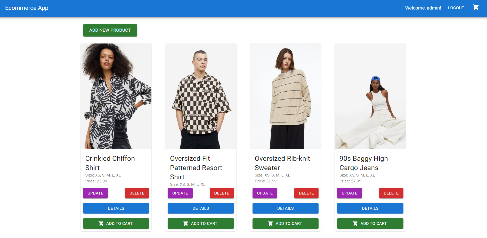
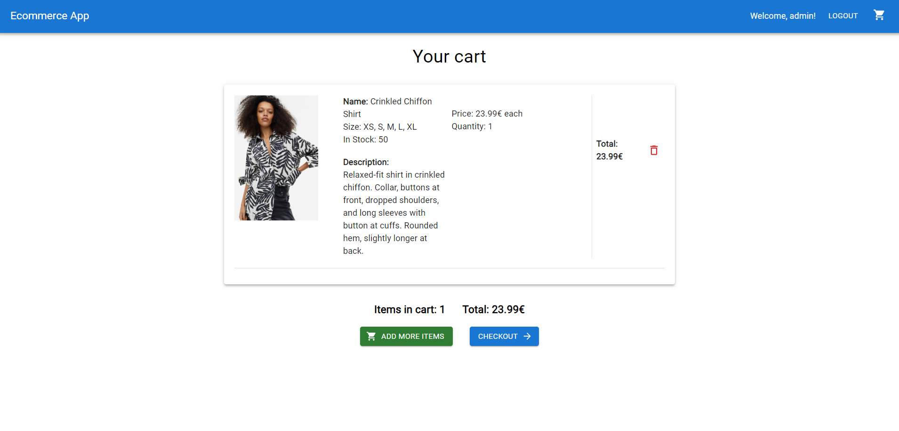

# E-Commerce App

## About

Welcome to our E-Commerce App, a modern and efficient platform built using React.js, Spring Boot, and MySQL. This application provides a seamless shopping experience for both customers and administrators, combining a user-friendly interface with robust backend functionality.

### Features

- Browse and search for products
- User authentication and authorization
- Cart management
- Admin dashboard for product and user management

## Screenshots





## Getting Started

To get started with the E-Commerce App, follow these steps:

### Prerequisites
- Set up a MySQL database and configure the Spring Boot application properties accordingly.
    - You may need to connect the Spring Boot server to your MySQL database. Update the `application.properties` file in the `backend` directory with your database details.

### Installation

1. Clone the repository:
   ```bash
   git clone https://github.com/MariusDevelops/ecommerce-app.git
2. Install dependencies:
   ```bash
   cd client
   npm install
3. Run the React.js frontend:
   ```bash
   npm run dev
4. Navigate to the backend directory and configure the Spring Boot application properties.
5. Run the Spring Boot backend.
6. Access the application at http://localhost:5173/.

Feel free to explore our E-Commerce App!
